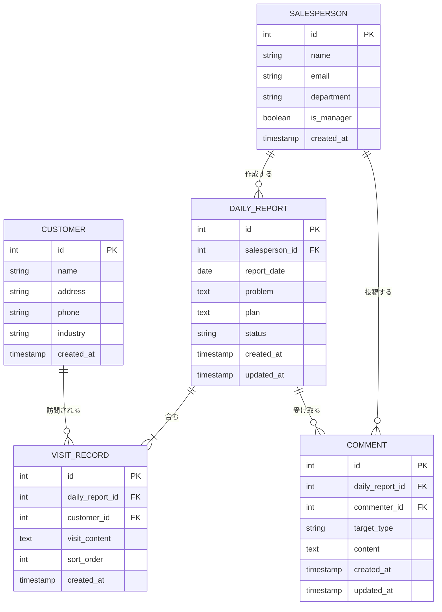

# 営業日報システム ER図

**バージョン:** 1.0  
**作成日:** 2026-05-08  
**対象システム:** 営業日報システム

---

## ER図

---

## テーブル定義

### SALESPERSON（営業マスタ）

| カラム名 | 型 | 制約 | 説明 |
|---------|-----|------|------|
| id | int | PK / AUTO INCREMENT | 営業ID |
| name | string(50) | NOT NULL | 氏名 |
| email | string(255) | NOT NULL / UNIQUE | メールアドレス（ログインID） |
| department | string(100) | - | 所属部署 |
| is_manager | boolean | NOT NULL / DEFAULT false | 上長フラグ |
| created_at | timestamp | NOT NULL | 登録日時 |
| updated_at | timestamp | NOT NULL | 更新日時 |

### CUSTOMER（顧客マスタ）

| カラム名 | 型 | 制約 | 説明 |
|---------|-----|------|------|
| id | int | PK / AUTO INCREMENT | 顧客ID |
| name | string(100) | NOT NULL | 顧客名 |
| address | string(255) | - | 住所 |
| phone | string(20) | - | 電話番号 |
| industry | string(100) | - | 業種 |
| created_at | timestamp | NOT NULL | 登録日時 |
| updated_at | timestamp | NOT NULL | 更新日時 |

### DAILY_REPORT（日報）

| カラム名 | 型 | 制約 | 説明 |
|---------|-----|------|------|
| id | int | PK / AUTO INCREMENT | 日報ID |
| salesperson_id | int | FK → SALESPERSON.id / NOT NULL | 作成者 |
| report_date | date | NOT NULL | 対象日 |
| problem | text(2000) | - | 今の課題・相談 |
| plan | text(2000) | - | 明日やること |
| status | string | NOT NULL / DEFAULT 'draft' | draft / submitted / reviewed |
| created_at | timestamp | NOT NULL | 登録日時 |
| updated_at | timestamp | NOT NULL | 更新日時 |

**ユニーク制約:** `(salesperson_id, report_date)` — 1人1日1件

### VISIT_RECORD（訪問記録）

| カラム名 | 型 | 制約 | 説明 |
|---------|-----|------|------|
| id | int | PK / AUTO INCREMENT | 訪問記録ID |
| daily_report_id | int | FK → DAILY_REPORT.id / NOT NULL | 日報ID |
| customer_id | int | FK → CUSTOMER.id / NOT NULL | 顧客ID |
| visit_content | text(1000) | NOT NULL | 訪問内容 |
| sort_order | int | NOT NULL | 表示順 |
| created_at | timestamp | NOT NULL | 登録日時 |

### COMMENT（コメント）

| カラム名 | 型 | 制約 | 説明 |
|---------|-----|------|------|
| id | int | PK / AUTO INCREMENT | コメントID |
| daily_report_id | int | FK → DAILY_REPORT.id / NOT NULL | 日報ID |
| commenter_id | int | FK → SALESPERSON.id / NOT NULL | 投稿者（上長） |
| target_type | string | NOT NULL | problem / plan |
| content | text(1000) | NOT NULL | コメント内容 |
| created_at | timestamp | NOT NULL | 登録日時 |
| updated_at | timestamp | NOT NULL | 更新日時 |

---

## リレーション説明

| リレーション | 多重度 | 説明 |
|------------|--------|------|
| SALESPERSON → DAILY_REPORT | 1対多 | 1人の営業が複数の日報を作成する |
| DAILY_REPORT → VISIT_RECORD | 1対多（1件以上） | 1つの日報に複数の訪問記録を持つ（最低1件必須） |
| CUSTOMER → VISIT_RECORD | 1対多 | 1つの顧客が複数の訪問記録に紐づく |
| DAILY_REPORT → COMMENT | 1対多 | 1つの日報に複数のコメントが付く |
| SALESPERSON → COMMENT | 1対多 | 1人の上長が複数のコメントを投稿する |

---

*以上*
